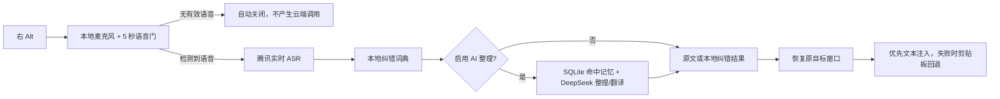
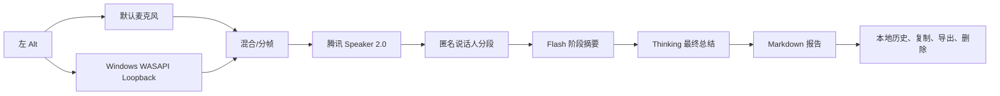
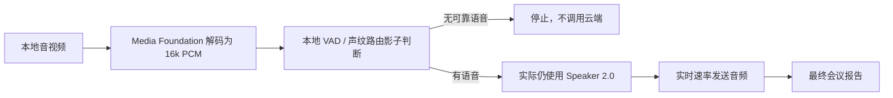

# 整体架构

## 日常语音输入

关键点：

- 录音开始时保留约一秒的内存预缓冲，避免云连接阶段漏掉开头；
- 结束后等待腾讯返回最终句，再执行本地词典和可选的大模型整理；
- 剪贴板原内容会尽量恢复；竞争失败会写诊断日志，不记录剪贴板正文。

## 实时会议纪要

客户端只能采集当前电脑实际收到的音频。手机上单独进行的会议、未在电脑播放的远端声音无法被捕获。

## 导入音视频

本地路由器目前对多人样本安全召回较好，但对真实单人样本过于敏感，节费价值没有达到发布门槛。因此 `ShadowModeEnabled=true`，不能宣称“自动选择更便宜 ASR”已经上线。

## 数据边界

| 数据 | 位置/去向 | 说明 |
|---|---|---|
| API 凭证 | `%LOCALAPPDATA%\VoiceMemoryDemo\settings.dat` | Windows DPAPI、当前用户范围 |
| 记忆与历史 | `voice-memory.db` | SQLite，本地保存 |
| 会议报告 | `Meetings\` | Markdown，本地保存 |
| 音频 | 腾讯云 ASR | 实时发送，不在当前客户端另存原始会议音频 |
| 转写与命中记忆 | DeepSeek（启用 AI 时） | 用于整理、翻译和总结 |
| 诊断 | `diagnostics.log` / `speaker-router.jsonl` | 不记录密钥与剪贴板正文 |

## 源码模块

- `MainWindow`：状态机、热键调度与 UI；
- `AudioRecorderService` / `LiveSpeechDetectionService`：录音和本地语音门；
- `TencentAsrSession`：签名、WebSocket、实时结果和说话人标签；
- `DeepSeekTextService`：整理、翻译和会议总结；
- `TextInjectionService`：目标窗口恢复、注入和剪贴板回退；
- `MemoryRepository` / `LocalEmbeddingService`：SQLite 与可选向量检索；
- `MeetingMediaImportService` / `MeetingMinutesService`：导入、分段和报告生成；
- `LocalSpeakerRouterService`：VAD、声纹聚类、重叠检测和安全路由建议。

## 威胁与产品化差距

当前是 BYOK 桌面 Demo。DPAPI 能防止密钥以明文落盘，但不能防止同一 Windows 用户下的恶意进程读取运行时内存。面向公众发布托管产品时，应增加后端代理、短期凭证、账户隔离、速率限制、审计、崩溃上报脱敏、代码签名与自动更新。
